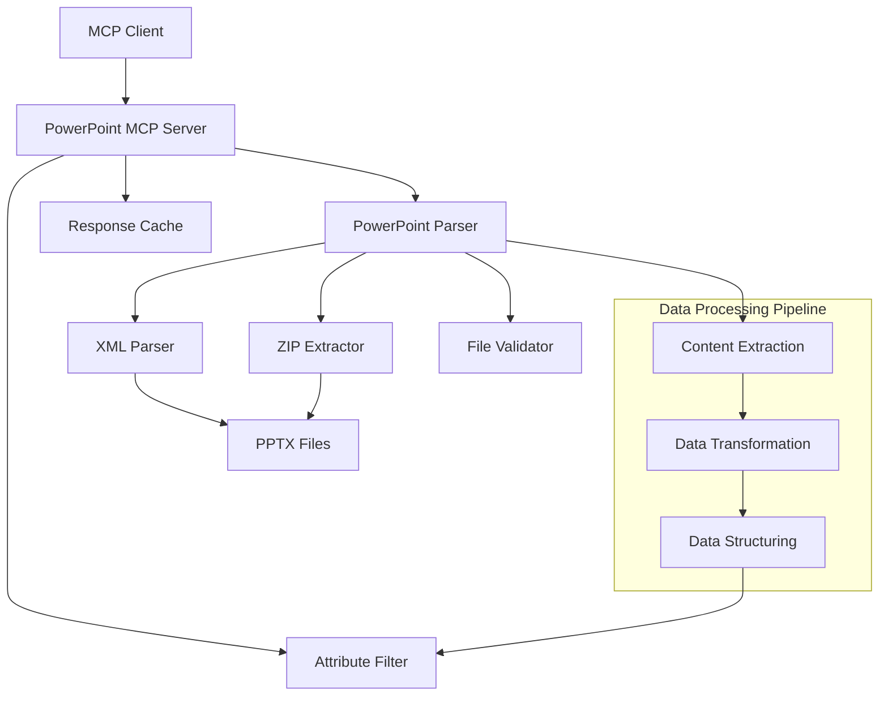
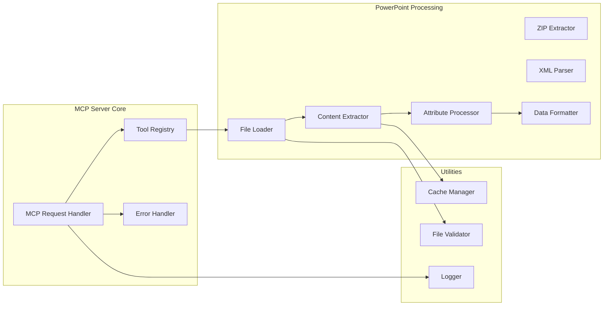

# Design Document

## Overview

PowerPoint MCP Serverは、PowerPointファイル（.pptx形式のみ）の内容を構造化されたデータとして抽出し、MCP（Model Context Protocol）を通じて提供するサーバアプリケーションです。このサーバは、スライドの詳細情報、レイアウト、テキスト要素、メタデータを効率的に処理し、クライアントアプリケーションが必要とする特定の属性のみを取得できる柔軟なAPIを提供します。

### Technical Approach

**.pptxファイル処理**: Office Open XML形式の.pptxファイルはZIPアーカイブとして構成されているため、zipfileモジュールで展開し、内部のXMLファイルを直接解析します。この軽量なアプローチにより、外部ライブラリに依存せずに高速で効率的な処理を実現します。

**対象ファイル形式**: .pptxファイルのみをサポート（.pptファイルは対象外）

**技術スタック**:
- **zipfile**: .pptxファイルのZIP展開（Python標準ライブラリ）
- **xml.etree.ElementTree**: XML解析（Python標準ライブラリ）
- **MCP SDK**: Model Context Protocolの実装
- **asyncio**: 非同期処理サポート（Python標準ライブラリ）

## Architecture

### High-Level Architecture



### Component Architecture



## Components and Interfaces

### 1. MCP Server Core

#### MCPRequestHandler
- **責任**: MCP プロトコルリクエストの処理とレスポンス生成
- **主要メソッド**:
  - `handle_tool_call(tool_name, parameters)`: ツール呼び出しの処理
  - `get_tool_definitions()`: 利用可能なツールの定義を返す
  - `handle_error(error)`: エラーハンドリング

#### ToolRegistry
- **責任**: 利用可能なMCPツールの登録と管理
- **登録ツール**:
  - `extract_powerpoint_content`: 完全なコンテンツ抽出
  - `get_powerpoint_attributes`: 特定属性の取得
  - `get_slide_info`: 個別スライド情報の取得

### 2. PowerPoint Processing Components

#### FileLoader
- **責任**: PowerPointファイルの読み込みと基本検証
- **主要メソッド**:
  - `load_presentation(file_path)`: プレゼンテーションファイルの読み込み
  - `validate_file(file_path)`: ファイル形式と存在の検証
  - `get_file_metadata(file_path)`: ファイルメタデータの取得
  - `validate_pptx_format(file_path)`: .pptxファイル形式の検証

#### ZipExtractor
- **責任**: .pptxファイルのZIP展開とXMLファイル抽出
- **主要メソッド**:
  - `extract_pptx_archive(file_path)`: .pptxファイルをZIPとして展開
  - `get_xml_files()`: 必要なXMLファイルのリストを取得
  - `extract_specific_xml(xml_path)`: 特定のXMLファイルを抽出
  - `cleanup_temp_files()`: 一時ファイルのクリーンアップ

#### XMLParser
- **責任**: Office Open XMLファイルの解析
- **主要メソッド**:
  - `parse_presentation_xml()`: presentation.xmlの解析
  - `parse_slide_xml(slide_path)`: 個別スライドXMLの解析
  - `parse_slide_layout_xml(layout_path)`: スライドレイアウトXMLの解析
  - `parse_theme_xml(theme_path)`: テーマXMLの解析
  - `extract_relationships(rels_path)`: リレーションシップの解析

#### ContentExtractor
- **責任**: 解析されたXMLデータからの構造化データ抽出
- **主要メソッド**:
  - `extract_all_content(xml_data)`: 全コンテンツの抽出
  - `extract_slide_content(slide_xml)`: 個別スライドコンテンツの抽出
  - `extract_text_elements(slide_xml)`: テキスト要素の抽出
  - `extract_table_data(slide_xml)`: テーブルデータの抽出
  - `extract_layout_info(slide_xml, layout_xml)`: レイアウト情報の抽出
  - `extract_placeholder_info(slide_xml)`: プレースホルダ情報の抽出
  - `extract_notes_content(notes_xml)`: ノート内容の抽出
  - `count_slide_objects(slide_xml)`: スライド内オブジェクト数の計算

#### AttributeProcessor
- **責任**: 特定属性のフィルタリングと処理
- **主要メソッド**:
  - `filter_attributes(data, requested_attributes)`: 属性フィルタリング
  - `process_slide_attributes(slide, attributes)`: スライド属性の処理
  - `count_objects(slide)`: オブジェクト数の計算

### 3. Utility Components

#### FileValidator
- **責任**: ファイルの検証とセキュリティチェック
- **検証項目**:
  - ファイル存在確認
  - ファイル形式検証（.pptxのみ）
  - ファイルサイズ制限
  - ファイル破損チェック

#### CacheManager
- **責任**: 処理結果のキャッシュ管理
- **機能**:
  - ファイルハッシュベースのキャッシュキー生成
  - メモリベースの一時キャッシュ
  - キャッシュ有効期限管理

## Data Models

### PowerPointDocument
```python
@dataclass
class PowerPointDocument:
    file_path: str
    title: str
    author: str
    created_date: datetime
    modified_date: datetime
    slide_count: int
    slide_size: Tuple[int, int]  # (width, height)
    sections: List[Section]
    slides: List[Slide]
```

### Slide
```python
@dataclass
class Slide:
    slide_number: int
    section_name: Optional[str]
    layout_name: str
    layout_type: str
    title: Optional[str]
    subtitle: Optional[str]
    notes: Optional[str]
    placeholders: List[Placeholder]
    text_elements: List[TextElement]
    tables: List[Table]
    images: List[Image]
    shapes: List[Shape]
    object_counts: Dict[str, int]
```

### TextElement
```python
@dataclass
class TextElement:
    content_plain: str  # フォーマット情報のタグを削除したテキスト
    content_formatted: str  # フォーマット情報のタグを残したテキスト
    font_sizes: List[int]  # 使用されているフォントサイズの配列
    font_colors: List[str]  # 使用されているフォント色の配列
    hyperlinks: List[str]  # ハイパーリンクURLの配列
    bolded: int  # 太字属性が設定された回数
    italic: int  # 斜体属性が設定された回数
    underlined: int  # 下線属性が設定された回数
    highlighted: int  # ハイライト属性が設定された回数
    strikethrough: int  # 取り消し線属性が設定された回数
    position: Tuple[int, int]
    size: Tuple[int, int]
```

### Table
```python
@dataclass
class Table:
    rows: int
    columns: int
    cells: List[List[TableCell]]
    position: Tuple[int, int]
    size: Tuple[int, int]

@dataclass
class TableCell:
    content: str
    row_span: int
    col_span: int
    formatting: TextFormatting
```

### Placeholder
```python
@dataclass
class Placeholder:
    placeholder_type: str  # title, subtitle, content, etc.
    position: Tuple[int, int]
    size: Tuple[int, int]
    content: Optional[str]
```

## Error Handling

### Error Categories

1. **File Access Errors**
   - ファイルが存在しない
   - ファイルアクセス権限がない
   - ファイルが使用中

2. **File Format Errors**
   - サポートされていないファイル形式
   - 破損したPowerPointファイル
   - 暗号化されたファイル

3. **Processing Errors**
   - メモリ不足
   - 処理タイムアウト
   - 予期しないファイル構造

4. **MCP Protocol Errors**
   - 無効なパラメータ
   - サポートされていないツール呼び出し
   - レスポンス形式エラー

### Error Response Format
```python
@dataclass
class ErrorResponse:
    error_code: str
    error_message: str
    error_details: Optional[Dict[str, Any]]
    suggestions: Optional[List[str]]
```

## Testing Strategy

### Unit Testing
- **FileLoader**: ファイル読み込みとバリデーション
- **ContentExtractor**: 各種コンテンツ抽出機能
- **AttributeProcessor**: 属性フィルタリング機能
- **DataFormatter**: データ形式変換

### Integration Testing
- **MCP Protocol**: ツール呼び出しとレスポンス
- **End-to-End**: 実際のPowerPointファイルでの完全な処理フロー
- **Error Scenarios**: 各種エラーケースの処理

### Test Data
- **Sample PowerPoint Files**:
  - 基本的なテキストスライド
  - テーブルを含むスライド
  - 画像を含むスライド
  - 複雑なレイアウトのスライド
  - セクション分けされたプレゼンテーション
  - 破損したファイル（エラーテスト用）

### Performance Testing
- **Large File Handling**: 大きなPowerPointファイルの処理性能
- **Memory Usage**: メモリ使用量の監視
- **Concurrent Requests**: 同時リクエスト処理能力

## Security Considerations

### File Access Security
- ファイルパスのサニタイゼーション
- ディレクトリトラバーサル攻撃の防止
- ファイルサイズ制限の実装

### Data Privacy
- 一時ファイルの適切な削除
- キャッシュデータの暗号化
- ログ出力時の機密情報マスキング

### Resource Management
- メモリ使用量の制限
- 処理時間の制限
- 同時処理数の制限